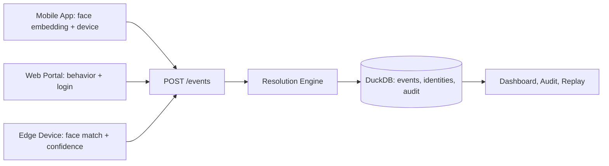
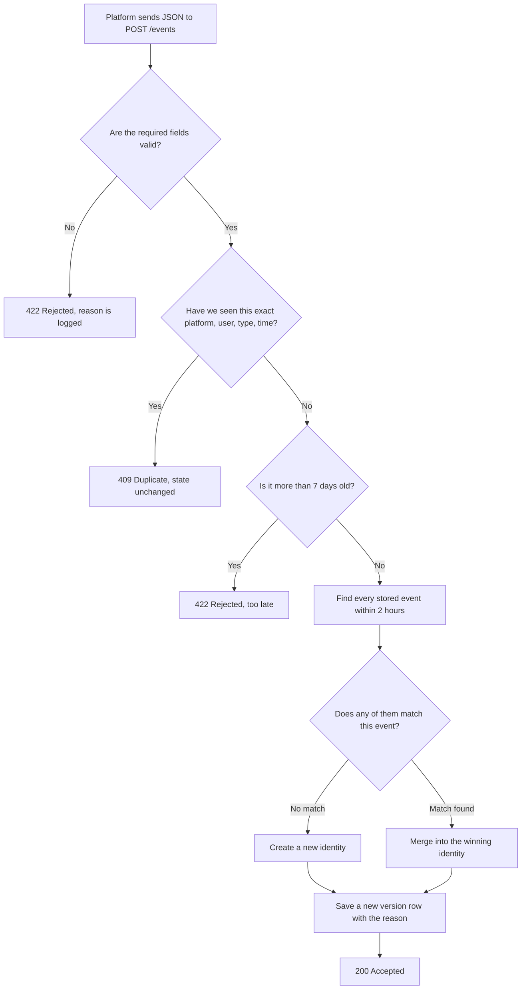
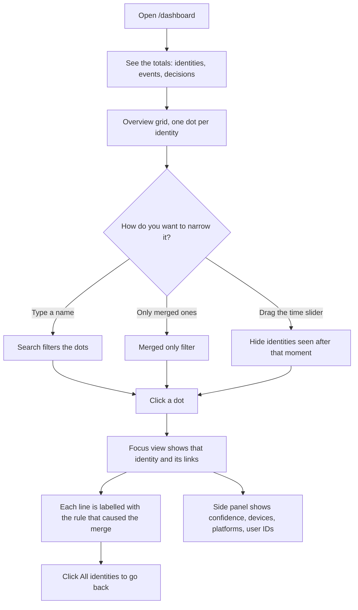
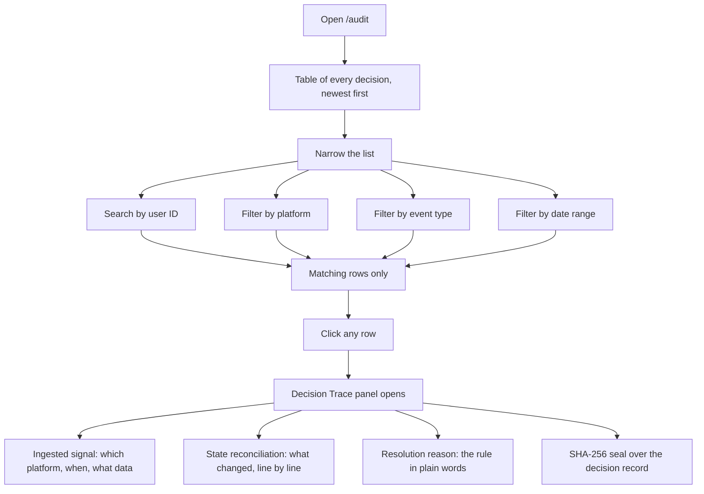
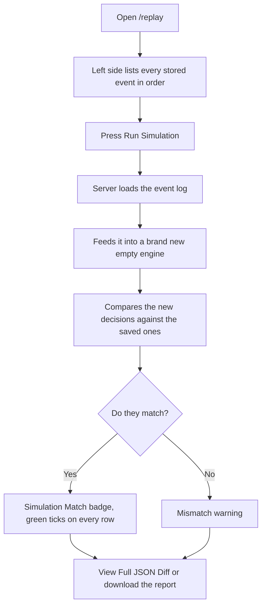
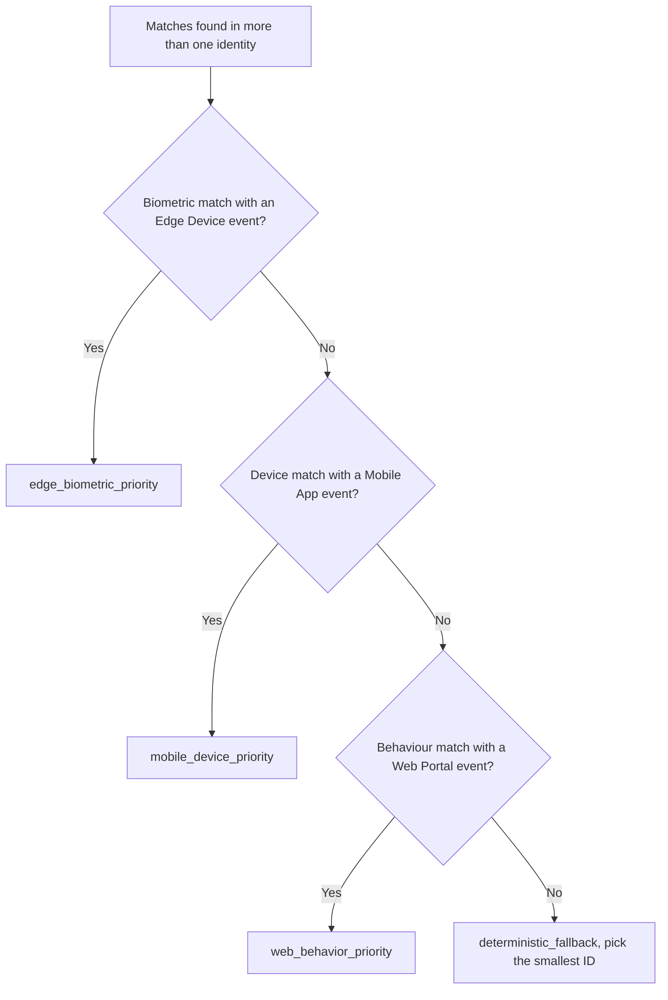

# Aether Identity

A real time identity resolution engine. It takes login and biometric signals from three
different platforms, works out which signals belong to the same person, and keeps a full
audit trail of every decision it made and why.

Every decision is deterministic. The same events always produce the same result, and you
can replay the whole history at any time to prove it.



## Contents

1. [What problem this solves](#what-problem-this-solves)
2. [Quick start](#quick-start)
3. [The four pages](#the-four-pages)
4. [User flows](#user-flows)
5. [How resolution works](#how-resolution-works)
6. [API reference](#api-reference)
7. [Sample data](#sample-data)
8. [Tests](#tests)
9. [Project layout](#project-layout)
10. [Design decisions](#design-decisions)

## What problem this solves

One real person shows up on your systems as several different user IDs. They log in on
their phone, browse on the web portal, and scan their face at a kiosk. Each platform gives
them a different ID.

The engine looks at the signals in each event and decides when two IDs are really the same
person. It then merges them into one identity, and records exactly which rule caused the
merge so an auditor can check the reasoning later.

The hard parts it handles:

| Problem | How it is handled |
| --- | --- |
| The same event arrives twice | Duplicate keys are rejected, state is never touched |
| An event arrives days late | Accepted up to 7 days behind, still merged correctly |
| Events arrive out of order | Resolution looks both forwards and backwards in time |
| Two rules disagree | A fixed priority order picks the winner, never a coin flip |
| An auditor asks "why?" | Every decision stores its inputs, reason, and a hash |

## Quick start

You need Python 3.11 or newer. It was developed on 3.14.

```bash
pip install -r requirements.txt
uvicorn server:app --port 8000
```

Now open http://localhost:8000 in your browser.

A fresh install has no data in it, so load the sample data first:

```bash
python fixtures/make_fixtures.py            # writes the 6 edge case files
python fixtures/seed_100.py                 # sends 100 identities to the running server
```

The pages pull React, Tailwind, and fonts from public CDNs, so your browser needs an
internet connection. The backend itself works fully offline.

State is saved in `identity.duckdb` in the project folder. Delete that file to start over.
Set the `IDRES_DB` environment variable to use a different path.

## The four pages

| Page | Address | What you do there |
| --- | --- | --- |
| Landing | `/` | Read what the product does, jump into any tool |
| Dashboard | `/dashboard` | See all identities, explore how one was resolved |
| Audit History | `/audit` | Search every decision, open a full decision trace |
| Replay Verification | `/replay` | Re-run history and prove the results still match |

## User flows

### Flow 1: A signal arrives and becomes an identity

This is the main path. A platform sends one JSON event, and the engine decides what to do
with it.



### Flow 2: Exploring identities on the dashboard

The dashboard starts wide and lets you narrow down to one identity.



In the overview, each dot tells you three things at once:

- **Size** is how many events that identity contains.
- **Colour** is what kind of signal resolved it. Teal means edge verified by biometrics,
  indigo means mobile anchored by device, orange means web or behaviour only.
- **A ring** around the dot means two or more user IDs were merged into it.

### Flow 3: Auditing a single decision

This is the flow a compliance reviewer would take.



Rejected and duplicate events appear in this table too, so nothing is hidden. Selecting one
shows why it was refused and confirms that no state changed.

### Flow 4: Proving the results are reproducible



Replay never writes to your database. It builds a throwaway in memory engine, so running it
a hundred times changes nothing.

## How resolution works

### Step 1: Find the candidates

When a new event arrives, the engine collects every stored event whose timestamp is within
**2 hours** either side. Nothing outside that window can ever be matched.

### Step 2: Test each candidate

A candidate matches if any of these are true:

| Signal | Rule |
| --- | --- |
| Biometric | Cosine distance between the two 128 number embeddings is 0.15 or less |
| Device | The `device_id` values are exactly the same |
| Behaviour | They share a numeric key, and every shared value agrees within 25 percent |

### Step 3: Break ties in a fixed order

If the matches point at more than one existing identity, that is a conflict. The engine
walks this ladder from the top and stops at the first rule that fires.



The final fallback sorts the candidate IDs alphabetically and takes the first one. It looks
arbitrary, but it guarantees the same answer every single run, which is the whole point.

### Step 4: Merge and record

The winning identity absorbs the new event. The canonical ID for the merged group is the
alphabetically smallest user ID in it. A new version row is written with the decision time,
the strategy name, the reason in plain English, and the full merged record.

### The strategies you will see

| Strategy | Meaning |
| --- | --- |
| `new_identity` | Nothing matched, a fresh identity was created |
| `same_user_append` | The event matched only its own existing identity |
| `edge_biometric_priority` | Faces matched, and an Edge Device vouched for it |
| `mobile_device_priority` | Same physical device as a Mobile App event |
| `web_behavior_priority` | Behaviour lined up with a Web Portal event |
| `deterministic_fallback` | Matched, but no priority rule applied |

### Two rules that keep it honest

**Lateness is measured against the newest event seen, not the clock on the wall.** If it
used the real clock, the same input file would produce different results tomorrow. That
would break determinism, so a watermark is used instead.

**The decision timestamp is the event's own timestamp, not the time it was processed.** Same
reason.

## API reference

### Sending events

`POST /events` takes one JSON object.

```json
{
  "platform": "edge",
  "event_type": "face_auth",
  "timestamp": "2026-08-16T10:00:00Z",
  "user_id": "u1",
  "device_id": "kiosk-1",
  "embedding": [0.1, 0.2, "...128 numbers total"],
  "confidence": 0.97,
  "behavior_data": { "click_freq": 12.0 }
}
```

`platform`, `event_type`, `timestamp`, `user_id`, and `device_id` are required. `embedding`,
`confidence`, and `behavior_data` are optional.

| Response | Meaning |
| --- | --- |
| `200` | Accepted, the body tells you the identity, version, and strategy |
| `409` | Duplicate, nothing changed |
| `422` | Rejected, the body explains why |

### Reading data

| Endpoint | Returns |
| --- | --- |
| `GET /api/identities` | Every merged identity record |
| `GET /api/identities/{id}` | One identity plus its full version history |
| `GET /api/audit` | All decisions, plus all rejections and duplicates |
| `GET /api/decision/{seq}` | One decision with its input event, the previous state, and a hash |
| `GET /api/events` | The raw accepted event log |
| `POST /api/replay` | Runs a replay and reports whether it matched |
| `GET /api/audit/export` | Downloads the whole audit report as JSON |

### Command line replay

You can replay any file of events without touching the server.

```bash
python replay.py fixtures/04_conflict_tiebreak.json
python replay.py fixtures/*.json --audit-dir audit_output
python replay.py fixtures/03_biometric_merge.json --db my.duckdb
```

Each run loads the file into a fresh engine, checks itself by replaying its own log, and
writes a trace file into `audit_output/`.

## Sample data

### The 6 edge case files

Run `python fixtures/make_fixtures.py` to regenerate them.

| File | What it demonstrates |
| --- | --- |
| `01_duplicates.json` | The same event sent twice is a no-op |
| `02_late_events.json` | One event 6 days late is accepted, one 8 days late is refused |
| `03_biometric_merge.json` | A mobile face and an edge face merge, a stranger stays separate |
| `04_conflict_tiebreak.json` | One event matches two identities, edge biometrics win |
| `05_midnight_boundary.json` | 23:30 and 00:30 merge, 03:00 does not |
| `06_behavior_link.json` | Similar behaviour merges, very different behaviour does not |

### The 100 identity dataset

`python fixtures/seed_100.py` builds 247 events covering 100 people and posts them to the
running server. It is fully deterministic, so you get the same result every time.

- 60 people log in on mobile and then browse the web on the same device, which merges by
  device fingerprint.
- 40 people log in on mobile, scan at a kiosk, then scan again on mobile, which merges by
  biometrics.
- 7 duplicate resends prove that repeats change nothing.

Use `--dry-run` to write `fixtures/seed_100.json` without sending anything.

### Audit outputs

`audit_output/` holds a generated trace for each fixture. Each file contains the ingest
result for every event, the counts by status, the full audit trail, the final identities,
and the replay verification result.

## Tests

```bash
python -m pytest tests/ -q
```

13 tests cover the parts of the specification that are easy to get wrong.

| Area | Tests |
| --- | --- |
| Validation | Missing fields, bad platform, bad timestamp, wrong embedding size, bad confidence |
| Duplicates | Repeated events do not change state, rejections are logged |
| Timing | The 7 day boundary on both sides, out of order arrivals, midnight, the exact 2 hour edge |
| Tie breaking | All three priority rules, plus the case where behaviour should not merge |
| Replay | Reproduces the same trail, is idempotent, and hashes match across engines |

## Project layout

```
engine.py                  Validation, resolution, storage, audit, replay
server.py                  FastAPI app: the /events endpoint, the /api endpoints, the pages
replay.py                  Command line replay tool

frontend/
  index.html               Landing page
  dashboard.html           Identity graph and totals
  audit.html               Audit table and decision traces
  replay.html              Replay verification tool
  theme.js                 Shared design tokens
  app.js                   Shared data helpers

fixtures/
  make_fixtures.py         Builds the 6 edge case files
  seed_100.py              Builds and sends the 100 identity dataset
  *.json                   The generated datasets

tests/test_engine.py       The test suite
audit_output/*.json        Generated decision traces
assets/                    Images used by the site
```

### Where things are stored

DuckDB holds four tables.

| Table | Holds |
| --- | --- |
| `events` | Every accepted event, including the original JSON for replay |
| `clusters` | Which user IDs belong to which identity |
| `identity_versions` | One row per decision, the audit trail |
| `rejections` | Every refused or duplicate event and the reason |

## Design decisions

**Why no ONNX Runtime on the server.** The platforms send embeddings that are already
computed, which is what the specification describes. There is no inference step left to run,
so adding the runtime would be dead weight.

**Why no Airflow or cloud services.** Nothing here needs orchestration. Batch replay is a
command line tool, and DuckDB covers all the storage.

**Why an in memory index.** DuckDB is the durable log, but scanning it for every incoming
event was too slow at around 26 events per second. An index that is rebuilt on startup
brings this to roughly 165 events per second on one core, which clears the 100 per second
target.

**Why the graph has two views.** No two identities share a link, so drawing 113 of them side
by side produced a wall of noise. The overview now shows one dot per identity for finding
things, and the focus view shows the real structure of one identity for understanding it.
